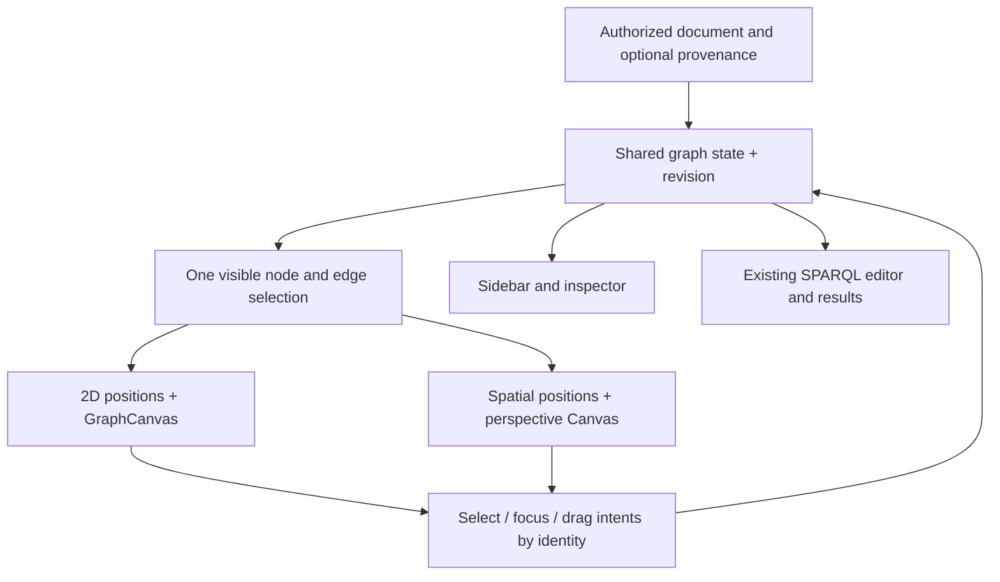

# DatabaseStudioUI

## Purpose and Scope

Status: presentation revised 2026-10-02. The spatial implementation uses a bounded
relationship network. Native verification and its limits are recorded in
[SpatialGraph](SpatialGraph/DESIGN.md); broader Studio acceptance remains pending.

Parent: [Database Studio](../../DESIGN.md).
Children: [ResultPresentation](ResultPresentation/DESIGN.md),
[AnalysisWorkspace](AnalysisWorkspace/DESIGN.md),
[SpatialGraph](SpatialGraph/DESIGN.md),
[GraphClustering](GraphClustering/DESIGN.md),
[RuntimeQuery](RuntimeQuery/DESIGN.md),
[RuntimeConnection](RuntimeConnection/DESIGN.md).
Existing folders are source navigation locations, not newly declared component
boundaries. Studio integrates the existing database runtime through DatabaseClient; it does
not implement a new runtime. Source-dependent presentation capabilities remain
explicit gates until their canonical operations are connected.

The requested result uses 3D where changing viewpoint helps explore intersecting
relationships. Tables, attributes, schema diagrams and ontology hierarchies stay
2D. The reference video supplies a visual direction for the spatial network:
small points, restrained lines, sparse labels and stable viewpoint changes.
Its animation is not evidence of database semantics or runtime performance.

### Fixed decisions

- Flat class and individual glyphs retain distinguishable silhouettes, icons,
  labels and domain colors; they have no extrusion, bevel or volumetric body.
- Ordinary network coordinates remain presentation layout. Feature analysis is
  independently owned by [GraphClustering](GraphClustering/DESIGN.md); its XY and
  membership are retained when [SpatialGraph](SpatialGraph/DESIGN.md) lifts them
  onto explicit semantic role layers. No inferred source nodes are created.
- The graph viewport defaults to 2D. An explicit spatial network view is available
  for relationship exploration; hierarchy-only and timeline network views remain 2D. Feature analysis can lift
  any admitted analyzed graph onto role layers; timeline remains a separate mode.
- Base selection, when available, is a source control independent of projection.
- The lower pane remains the SPARQL editor and Table/Raw result panel.
- Changing projection preserves data identity, selection, filters, query text,
  results, inspector state and navigation history.
- Unknown provenance, missing runtime access and unsupported capabilities are
  explicit states. Visual grouping is not permission, inference or membership.

The researched bundled example is owned by [GraphDataset](GraphDataset/DESIGN.md).
GraphView's `showsAllNodes` initial-visibility input admits the example's complete
node/class set while retaining 2D default and existing visibility for other sources.
GraphWindowState resets this example policy when its load source changes.
Instance classification consumes GraphEdge's semantic kind, preserving the
original Wikidata predicate IRI and readable label.

## Responsibilities and Boundaries

| Owner | Responsibility | Boundary |
|---|---|---|
| Graph window and `GraphViewState` | Document revision, selection, filtering, focus, query presentation and projection state | No independent renderer-owned copy of semantic state |
| Graph conversion in Studio | Preserve node/edge identity, role, labels and supplied provenance | No Base membership inferred from IRI, color, folder name or proximity |
| 2D layout / SpatialGraph | Presentation coordinates keyed by identity and revision | No changes to triples, class membership or authorization |
| `GraphCanvas` / spatial view | Draw the same visible graph and emit identity-based interaction intents | No storage handles, queries, grants or ontology reasoning |
| Existing query panel | Edit and evaluate local document queries; render results and errors | Projection switching never changes the query dataset |
| DatabaseKit / database runtime | Canonical ontology, Base, Composition and source/derived lineage | Studio consumes their contracts; it does not recreate them |

Use the existing state and conversion responsibilities before adding new
abstractions. This design does not introduce a public renderer protocol or
core-package DTO. Any eventual provenance carrier is Studio presentation state
wrapping canonical values, with exact API shape decided at its integration gate.

## Related Designs

| Design | Relationship | Contract Used | Summary | Cautions |
|---|---|---|---|---|
| [Package](../../DESIGN.md) | parent | Connection generation and authoritative shutdown | Owns access lifecycle | A stale scene must not outlive its data generation |
| [Workspace specification](../../../SPEC.md) | authority | Sections 8, 15, 16, 19 | Directory/Partition, Base, grants and Composition | Base partitions remain independent; federation has no global snapshot |
| [DatabaseKit](../../../database-kit/DESIGN.md) | depends on | Graph semantics and optional MultiBase values | Owns domain representation | Projection does not redefine canonical identity |
| [DatabaseFramework](../../../database-framework/DESIGN.md) | depends on | Execution, authorization and ontology reads | Supplies permitted data | Current Studio record access is unavailable |

## Architecture

```text
Graph window
├── Sidebar: class tree / available Base targets / filters
├── Detail column
│   ├── Toolbar: [2D | 3D network, when applicable] + independent source controls
│   ├── ONE graph viewport: GraphCanvas OR perspective Canvas presentation
│   │   └── in-viewport orbit / pan / zoom / fit / focus controls
│   └── Existing optional VSplitView lower pane
│       └── HSplitView: SPARQL editor | results [Table | Raw]
└── Existing inspector: Detail / Events / People / Places
```



### Confirmed current paths

These observations come from source, not a live-data rendering verification.

| Path | Current behavior and consequence |
|---|---|
| [ItemsContentView](Views/Items/ItemsContentView.swift) → [GraphWindowView](Views/Graph/GraphWindowView.swift) | A property-graph index enables loading records, constructing a graph, then merging ontology information |
| [Records conversion](Views/Graph/GraphDocument+Records.swift), [RDF conversion](Views/Graph/GraphDocument+RDF.swift) | Class membership becomes an edge; literal values become node metadata rather than additional visible nodes |
| [Ontology conversion](Views/Graph/GraphDocument+Ontology.swift) | Standalone conversion handles named class axioms and domain/range edges; merging into records adds classes and subclass edges. It does not retain import provenance |
| [GraphViewState](Views/Graph/GraphViewState.swift) | Removes `owl:Thing`, computes metrics, applies class/search/facet/neighborhood/backbone visibility, and owns separate full/focus layouts |
| [GraphCanvas](Views/Graph/GraphCanvas.swift) | Actual production renderer uses rounded squares for classes and circles for other roles; camera scale controls detail, icons and labels. `GraphNodeView` is not this rendering path |
| [GraphNodeStyle](Views/Graph/GraphNodeStyle.swift) and state | Class ancestors supply icons and domain colors; instances inherit them through their type edges |
| [GraphView](Views/Graph/GraphView.swift) → [QueryPanelView](Views/Graph/QueryPanelView.swift) | The optional bottom pane is a SPARQL editor plus Table/Raw results. Query execution uses the graph document snapshot, not the visible subset |
| [StudioDatabaseSession](Services/StudioDatabaseSession.swift) | Loads only the first stored ontology; record operations explicitly require a database runtime. A multi-ontology or MultiBase source is not currently wired |

## Contracts and Invariants

### Visual language

| Element | Presentation |
|---|---|
| Class | Flat rounded square with icon and label |
| Individual | Flat circle with icon and label |
| Other existing roles | Preserve their explicit role and fallback styling; do not convert metadata into invented graph objects |
| Domain family | Restrained inherited color; color never stands for Base authorization |
| Selection / search | Separate outline treatments; selection does not overwrite domain color |
| Relationship | Directed line with original predicate; show readable labels primarily near focus or at close zoom |
| Spatial overview and focus | Point density, line contrast and label priority follow [SpatialGraph](SpatialGraph/DESIGN.md); ordinary network retains no ontology-height planes; analyzed layers follow GraphClustering |
| Base | Independently bounded peer region containing its graph |
| Composition | Separate association to participating Base regions, never a relationship triple or containment edge |

Beauty comes from spacing, typographic hierarchy, stable motion, restrained
color and legible relationships. Labels and glyphs remain screen-facing throughout camera motion. No lighting-dependent contrast on node faces.
Respect light/dark appearance and reduced motion. Shape, text and the accessible
sidebar must identify objects without relying on color or depth alone.

### Shared projection state

2D/3D is presentation state, not a document reload. Both renderers consume
identical visible node/edge identities and shared filters. Occlusion and
level-of-detail are rendering decisions and do not remove graph data.

Retain independent 2D and 3D camera/position state. Returning to a visited mode
restores it rather than fitting again. The first spatial view initializes a
relationship-based layout under the child contract. Keep the selected identity
as the transition anchor. Spatial dragging changes presentation coordinates
only; it does not reparent nodes, edit relationships or move data between Bases.

Existing timeline layout remains a 2D presentation in the first implementation.
While timeline mode is active, explain why 3D is unavailable; switching requires
turning timeline off. Do not discard timeline state silently. The current 2D
minimap remains 2D-only; spatial Fit and orientation controls occupy the viewport.

### Presentation eligibility

| User task | Presentation | Spatial eligibility |
|---|---|---|
| Read values, edit a record, inspect properties or query rows | 2D table/editor/inspector | No spatial control in these surfaces |
| Inspect schema, class ancestry or a hierarchy-only graph | 2D diagram/tree | Hierarchy depth alone does not enable 3D |
| Trace relationships across a network of entities or mixed ontology/instance relations | 2D by default; explicit 3D network option | Actual relationship edges and an admitted spatial layout are required |
| Inspect time or geographic values | Existing dedicated 2D view | Their presence does not automatically create a spatial graph |
| Compare Base catalogs or source metadata | 2D list/table | Multiple sources alone do not justify 3D |

Eligibility is a presentation purpose plus an explicit user choice, not a node
count heuristic. No automatic switch on load, zoom, filtering or source change.
When a document revision loses spatial eligibility, retain selection and query
state and show the reason with an explicit return-to-2D action.

The ontology sidebar owns a readable class hierarchy; the spatial network can
include its original class/type edges when requested without mapping them to
height. Cycles and multiple parents remain original graph relations. Imported
ontology grouping requires supplied membership; an imports list alone is
insufficient. Spatial position is never evidence of a source or asserted fact.

### Source scope

Each Base, when its source capability is connected, is an independently identified
source scope. Its position is not a hierarchy or an authorization boundary.
Preserve a scoped presentation identity consisting of the supplied source scope
and local graph identity. Equal IRIs in different Bases must not be merged merely
to simplify rendering. For repeated representations of shared ontology classes,
retain one semantic identity plus distinct presentation occurrences; selection
must expose the current occurrence's scope.

Consume canonical `CompositionOrigin.source` or `.derived(contributors:)`.
Derived results occupy a clearly identified result group with all contributors;
never attribute them to an arbitrary single Base. Composition connections are
presentation associations, separate from the query's triples. Retain each
member's authorization and snapshot semantics; cross-domain Federation must
not be labeled a single consistent snapshot.

Until scoped data access and complete provenance are wired, MultiBase is shown
as unavailable with a reason. A production empty scene must not pretend to be a
successful MultiBase load. Demonstration data must be explicitly labeled.

## Runtime Flows

1. Accept a document revision and its source scope in the owning graph state.
2. Derive visibility once, preserving the existing filter and focus semantics.
3. Compute presentation coordinates for that revision under the active layout contract.
4. Publish only if the document, source generation and layout request still match.
5. Update the active renderer by stable identity; selection updates the existing
   sidebar and inspector, never a separate spatial selection model.
6. On a mode switch, pause the previous layout/render work and activate the other
   view from shared state. Keep the lower query pane mounted with unchanged state.

A projection switch issues zero storage reads and zero query executions. A
target change is different: it must enter a visible loading state and retain
result provenance. MultiBase query execution requires its own authorized runtime
integration; the current local evaluator must not receive an unqualified union
of multiple Base graphs that could merge identities or create cross-Base joins.

## State, Ownership, and Lifecycle

`GraphViewState` remains the MainActor semantic presentation owner. A spatial
view owns its scene entities. The parent retains the spatial camera and cached
coordinates. Spatial layout execution, cache keys, cancellation and bounds are
owned by [SpatialGraph](SpatialGraph/DESIGN.md); it cannot publish into a superseded
document or source generation.

Window close, source replacement, disconnect and renderer teardown cancel
pending work and release subscriptions/resources. Mode switching suspends hidden
simulation; it does not create a second continuously running graph session.
Stale loading/layout completion may not publish into a newer generation.

`GraphView` compares the complete input document rather than a count fingerprint,
so equal-count labels and edge replacements invalidate presentation. Window loading
uses a generation token and cancellation check; query submission uses a generation
token invalidated by document replacement. Projection changes do not invalidate
query results.

## Failure, Concurrency, and Constraints

The spatial view uses one on-demand native Canvas with perspective projection.
[SpatialGraph](SpatialGraph/DESIGN.md) owns camera projection, drawing and picking.
Availability or a numeric camera check is not native rendering acceptance.

If spatial initialization fails, retain the document and 2D state, display the
failure and offer explicit return to 2D. Do not silently substitute a renderer.
No camera hardware or AR tracking is part of the desktop interaction contract.

Resource limits belong to the presentation owner: visible glyphs/edges, labels,
cached coordinates and layout work are bounded. Reuse existing backbone
and visibility decisions. Choose operational limits from measurements on the
supported Mac and representative small/dense graphs; record the chosen limits
and measured input sizes in implementation evidence. Do not invent FPS promises.
Camera movement must not rebuild semantic documents or allocate one SwiftUI view
per node per frame. Update transforms and reuse glyph resources; disclose any
sampling or label reduction without reporting it as missing database data.

## Verification and Change Impact

### Falsifiable acceptance matrix

| Contract | Required evidence before implementation completion |
|---|---|
| Same graph across projections | Assert equal visible node/edge IDs, selected scoped identity, filters and query text/results through 2D → 3D → 2D; query/storage invocation counters stay unchanged |
| Existing pane preserved | Codex Computer use opens SPARQL, executes a query, switches both modes and checks editor, Table/Raw results, error presentation and divider position |
| Spatial network | Actual macOS screenshots and interaction show a point-and-line network at different orbit angles; selected point and related predicates remain identifiable; hierarchy-only views stay 2D |
| Ontology correctness | Cycles, multiple parents, untyped individuals and hidden classes retain original identities and edges; changing role does not manufacture a spatial hierarchy |
| Base isolation | Same IRI in two Bases stays distinguishable; source and derived contributor lineage round-trip through selection; absent capability is explicit |
| Snapshot freshness | Equal-count updates change labels/endpoints; stale background completion cannot overwrite a newer document or source generation |
| Lifecycle | Close/switch/disconnect during load/layout; confirm cancelled work cannot publish and scene subscriptions/resources release |
| Usability | Sidebar/inspector keyboard parity, reduced motion, light/dark contrast, dense-graph label readability, camera restoration |
| Platform and bounds | Timeout-bounded `xcodebuild test` on actual macOS drawing path; record toolchain, SDK, inputs, layout/frame cost, allocation/resource bounds and xcresult warnings |

Existing [RDF conversion tests](../../Tests/GraphDocumentTests/GraphDocumentRDFTests.swift)
and [ontology conversion tests](../../Tests/GraphDocumentTests/GraphDocumentOntologyTests.swift)
are regression inputs; native renderer evidence is owned by SpatialGraph. New rendering/state
checks belong to Studio's test targets, not DatabaseKit or storage backends.

### Implementation gates and bounded sequence

| Gate | Confirmed gap | Closure evidence |
|---|---|---|
| P1 — spatial network | Bounded deterministic network layout and retained relationship geometry replace SCC height grids and planes | Replace the layer contract in SpatialGraph, preserve original identities/edges and verify bounded layout, projection and actual native selection |
| P2 — presentation integration | Toolbar admits relationship networks, keeps hierarchy/timeline in 2D and preserves shared state | Apply purpose-based eligibility; verify 2D default, retained cameras, visibility and query-pane state with zero extra query/storage invocations |
| P3 — source membership | Current GraphDocument carries unscoped String IDs, not Base/import membership | Keep cross-source grouping unavailable until canonical scoped identity and lineage are supplied; this presentation task does not implement the runtime integration |

The current source already compares complete documents and stops 2D simulation
on entry to 3D. Retain those mechanisms. Implementation acceptance requires
P1 and P2's behavioral evidence; P3 remains a separate unavailable capability.
SpatialGraph records the native implementation evidence. These gates do not
establish the separate full-Studio acceptance matrix below.

Child design: [RuntimeConnection](RuntimeConnection/DESIGN.md), owning the
connection handshake, operation lifetime and server catalog.

## Complete Studio Implementation Scope

The user's full implementation request supersedes the earlier spatial-only
implementation boundary. Spatial work remains required, but cannot establish
Studio completeness. The following matrix is the acceptance authority for the
expanded work; PROGRESS.md records execution status without narrowing this scope.

| Requirement | Owner / execution source | Required observable evidence |
|---|---|---|
| Connection, authentication, history, reconnect, disconnect | Studio connection state -> DatabaseClient HTTP/WebSocket | Authenticated isolated server handshake, rejected credentials, cancelled connect, authoritative shutdown; secrets absent from history/logs |
| Capabilities and permission failures | capabilitiesDescribe and typed remote errors | Unsupported, forbidden, empty and failed remain distinguishable; disabled action explains missing capability |
| Database/Base/Composition selection | DatabaseSessionClient / MultiBase target contract | Same-IRI records in two Bases remain distinct; default database works without MultiBase |
| Schema and Directory/Partition inspection | schemaDescribe / schemaExecute and schema declarations | All field types, identity, constraints, relations and index configuration round-trip; dynamic partition values reach execution |
| Record browsing/detail/paging | queryExecute | Typed values retained; cursor pages neither duplicate nor omit records; loading cancellation and target changes discard stale results |
| Server search/filter/sort | QueryIR through queryExecute | Match beyond the first loaded page; explicit limit and ordering applied by runtime |
| Create/update/delete | mutationExecute | Round-trip, validation, conflicting update and denied mutation against real server |
| Query editor/history/results | queryExecute; Studio presentation history | Execute/cancel/save/reopen; Table/Raw identity and typed result/error retained |
| Graph exploration | queryExecute / graphAlgorithm | Neighbors, direction and paths match runtime results; bounded expansion |
| Ontology catalog/details/imports | ontologyExecute | Select multiple ontologies, inspect IRI/version/imports, hierarchy, properties, domain/range, axioms and instances |
| Inference and explanations | ontologyExecute | Asserted and inferred facts distinguished; provided explanations link to sources |
| SHACL | shaclExecute | Shapes, real validation violations and focus-node/property navigation |
| Base/Composition/Grant | corresponding canonical operations | Catalog/detail/authorized administration, effective rights, selection and contributor provenance; no inferred authority |
| Projection and pane integration | SpatialGraph and shared GraphViewState | Existing spatial acceptance matrix, real screenshots/selection/orbit, 2D restoration, query pane and inspector continuity |
| Import/export | Studio format adapters -> typed mutation/query | Types and scope preserved; preflight, progress and exact partial failures |
| Schema changes | schemaExecute | Preview difference, validate, apply, reread, rejection and failure |
| Index lifecycle | maintenanceExecute / job operations | Definition/state/build/rebuild results and real failed-job diagnosis |
| Durable jobs | jobStart/status/result/cancel | Target retained, state transitions, paging, cancellation, reconnect to known jobs |
| Specialized search/visualization | runtime full-text/vector/geographic/time contracts | Exact backend results represented in Studio; capability absence explicit |
| Query diagnostics/statistics/health | runtime query/maintenance/capabilities | Actual plan/index/cost/statistics, bounds and source identified; no fabricated metrics |
| Version history/diff/restore | supported runtime version contract | Historical values/differences and authorized restoration round-trip |
| Maintenance | canonical runtime maintenance operations | Real operation result, limits, cancellation and typed failures |

### Confirmed integration gaps

- Studio now imports DatabaseClient and exposes an authenticated runtime window
  with capabilities and schema discovery. Its direct-storage session rejects
  record and statistics operations by design. That inspection mode remains
  distinct from the runtime connection; data editing is not yet wired.
- DatabaseClient's released HTTP adapter owns framing, token headers, bounded
  responses, timeout/cancellation and transport shutdown; Studio must consume it.
- The inspected DatabaseClient 26.0904.0 exposes target-free calls by default and
  target-bound calls with the MultiBase trait. Selecting that trait globally is
  not proof of compatibility with both ordinary and MultiBase servers. Both
  paths must be verified before completing FULL-05.
- CapabilitiesDescribe exposes feature versions and job operation identifiers;
  it is not a substitute for per-operation authorization or effective Grant data.
- The existing local filter and SPARQL evaluators operate on loaded snapshots.
  They do not establish server-wide query execution.

### Responsive graph preparation

GraphDataset owns concurrent immutable resource reading/validation; SpatialGraph
owns concurrent immutable 3D solving. GraphViewState remains MainActor authority
for publication, visibility, cameras and cancellation. Source generation guards
apply after every asynchronous load/layout boundary.
2D initial and focus refinement retain the existing ForceDirectedLayout on
MainActor, but perform at most one physics tick per warmup turn and suspend
before the next tick. Returning from startup cannot synchronously run all warmup
iterations. Stop/switch/source replacement cancels the task before further
mutation. Initial Fit after refinement must respect user camera adjustment;
focus target publication must check cancellation before starting interpolation.
Headless tests verify nonblocking startup, cancellation and preserved identities;
Computer use verifies 2D restoration. No background access to mutable 2D state
or unsafe isolation is permitted.

The presentation owner currently uses one refinement tick per frame for more
than 256 nodes; smaller graphs retain the existing alpha-based one-to-six tick
policy. This private scheduling default changes only with measured per-tick and
input latency evidence; cancellation/identity/camera tests remain mandatory.
