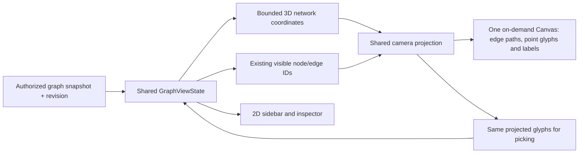

# SpatialGraph

## Purpose and Scope

Status: perspective Canvas performance revision 2026-10-03; focused native
behavior and Computer use interaction verified; evidence and limits are recorded below. Parent: [DatabaseStudioUI](../DESIGN.md). Children: none.
This component owns relationship-network and analyzed-layer presentation coordinates, camera,
spatial drawing and identity-based picking. Presentation eligibility belongs to
the parent. The video is a visual reference, not an executable specification.

## Responsibilities and Boundaries

Consume one admitted immutable graph snapshot, shared visibility and selection.
Consume [GraphClustering](../GraphClustering/DESIGN.md) results for semantic layers.
Return identity-based selection, focus and presentation-drag intents. Own no
storage access, query execution, reasoning, membership or authorization.

| Existing owner | Revised responsibility | Reason to change |
|---|---|---|
| [GraphSpatialLayout](GraphSpatialLayout.swift) | Deterministic bounded network coordinates and presentation offsets | Layout/readability; never domain hierarchy |
| [ThreeFingerRotation](ThreeFingerRotation.swift) | Bounded contact identity, translation and twist deltas | Contact count, movement and cancellation |
| [GraphSpatialCamera](GraphSpatialCamera.swift) | Shared world-to-screen basis, orbit, pan, zoom and Fit | Camera behavior and numerical limits |
| [GraphSpatialScene](GraphSpatialScene.swift) | Retained endpoint coordinates and normal/emphasized screen paths from the shared perspective projection | Document/position changes; camera motion projects retained endpoints |
| [GraphSpatialView](GraphSpatialView.swift) | Screen-facing point glyphs, label priorities and picking | Presentation and user interaction |
| [GraphViewState](../Views/Graph/GraphViewState.swift) | Snapshot revision, filters, selection, retained cameras and layout lifetime | Shared presentation state |

Reuse these owners without a renderer protocol, new package or external layout
service. The existing 2D ForceDirectedLayout owns a quadtree and 2D velocities;
it is not a working 3D solver and will not be renamed or globally generalized.

## Related Designs

| Design | Relationship | Contract Used | Summary | Cautions |
|---|---|---|---|---|
| [DatabaseStudioUI](../DESIGN.md) | parent / used by | Eligibility, shared identity/visibility, query-pane continuity | Owns view selection and source capabilities | 3D grants no data access; preserve local-versus-server query scope |

## Architecture



### Baseline before the network revision

| Path | Observed behavior | Required change |
|---|---|---|
| GraphSpatialLayout | SCC/longest-parent class depth becomes height; other roles follow below; nodes form a grid within each plane | Replace class-height layers with network coordinates |
| GraphSpatialScene | Builds low-opacity planes and one cylinder per relationship; compares allocated position arrays on every update | Remove planes from the revised path; use revision invalidation and retained geometry |
| GraphSpatialView | Canvas glyphs overlay native geometry; projection sorts far-to-near and picking scans near-to-far | Retain shared projection, add point/label emphasis and inspect projected bounds |
| GraphSpatialCamera | Perspective camera plus intersection with a horizontal plane | Retain projection/orbit; drag uses a camera-facing plane through the node |
| GraphViewState | Boolean projection state, independent spatial camera/cache, stops the 2D simulation | Retain shared semantic state; replace layer spacing and plane-constrained offsets |

On 2026-10-02 the actual layout and camera sources were compiled with Apple Swift
6.4 release on arm64 macOS. A runtime diagnostic confirmed SCC depths and
camera/plane round-trip after orbit, pan and zoom; nonfinite point rejection also
passed. This proves those numeric paths only. Native drawing, state switching and the replacement network solver were not
exercised by that baseline diagnostic.
The baseline [unit tests](../../../Tests/GraphDocumentTests/SpatialGraphTests.swift)
and the former UI test were read; their historical result bundles were unavailable in this session.

## Contracts and Invariants

### Spatial meaning and layout

- Coordinates express graph layout only. Proximity, height and empty space assert
  no equivalence, relationship, similarity, chronology or source membership.
- Retain every admitted node and original edge identity, direction and predicate.
  Parallel edges, cycles, multiple parents and disconnected nodes are valid.
- Use stable identity ordering and a fixed deterministic seed. Initialize from
  retained positions where available; otherwise seed all three axes, then relax all
  three coordinates using edge springs and node repulsion. No role-to-height rule.
- Compute coordinates from the admitted snapshot, not the current search/focus
  subset. Filtering and selection change draws, not unrelated node positions.
- The initial private solver uses bounded pairwise repulsion, O(V² + E) per
  iteration, and O(V + E) retained storage. Finite iteration and per-turn work
  budgets apply; convergence ends layout motion. A larger capacity requires a
  measured need and a verified spatial acceleration algorithm, not unbounded work.
- New documents invalidate the cache even when counts are equal. Retain positions
  of surviving identities as seeds. A renderer switch reuses the last layout.
- A fixed iteration limit may publish finite stable approximate coordinates;
  layout quality is not a database-query result. Nonfinite output is an explicit
  layout failure. Cancellation or elapsed resource limits publish no stale result.

### Visual language

| State/element | Treatment | Information carried |
|---|---|---|
| Overview | Small screen-facing points, faint thin edges; neutral background with light/dark variants | Network structure; no decorative particles |
| Near view | Flat role silhouettes; class square, individual circle, existing role styles | Object role without extrusion |
| Selected node | Clear outline and readable label; selected predicate direction/labels prioritized | Exact selected identity |
| Related nodes | Stronger point/edge contrast within the shared focus scope | Original relations only |
| Other visible nodes | Restrained contrast; remain pickable and searchable | Context without changing filters |
| Labels | Selected node first, then explicitly highlighted nodes, then nearby nodes within budget | Text readable in screen space |

The reference video's cylindrical or swirling silhouette is not a target shape.
Layout follows actual relationships; no artificial links, particles or stacked
class planes are added to reproduce the image. No default autoplay, continuous
orbit, bloom, glass slabs or per-node volumetric meshes. User orbit supplies
parallax; reduced motion suppresses animated camera transitions.

Draw and pick the same projected glyph center and shape with a declared pointer
tolerance. Overlap picks the nearest drawn glyph. A selected small point must
always gain a readable label even if normal label detail is suppressed. Label
collision/budget omission never removes node identity. Node/edge details remain
available through the keyboard-accessible sidebar and inspector.

## Runtime Flows

```text
Open graph -> 2D by default
    -> user selects spatial network
        -> eligibility and resource admission
            -> restore cached layout/camera OR compute bounded layout
                -> draw points and relationships
                    -> orbit / select / focus -> update shared state
    -> return to 2D -> restore 2D camera and selection
```

Spatial entry performs zero storage reads and zero query executions. Selection
uses the existing select intent. Explicit focus retains the existing neighborhood
filter; it is distinct from visual emphasis. Orbit, pan, pinch and Fit affect only
the camera. Ordinary pointer drag orbits; an explicit modifier-drag moves a node
on the camera-facing plane through its starting position. Drag pins a presentation
offset only and does not change any data. Existing sidebar navigation is retained.

### Three-finger camera input

```text
Indirect NSTouch events -> exactly three stable identities on one device
    -> centroid displacement + signed twist -> normalized camera quaternion
        -> identical perspective edge / glyph projection / picking
```

The existing CanvasInteractionResponder platform adapter opts into indirect and
resting touches only for the spatial viewport. Two-finger scroll/pinch retain
pan/zoom; 2D keeps its existing swipe navigation. Three-finger displacement
rotates about the current screen axes; twist rotates about the viewing axis.
The input boundary rotates the displayed network in the direction of the fingers:
rightward contacts move foreground points right, downward contacts move them
down, and clockwise contact twist turns the displayed network clockwise.
GraphSpatialCamera owns this conversion from touch displacement to camera orbit;
the view invokes that intent for three-finger input. Camera orbit itself retains
its existing convention for mouse dragging. Contact tracking retains raw screen
translation and signed twist; no natural-scroll preference changes raw contacts.
The quaternion permits full turns without pitch clamps or a world-up pole.
Retain at most three prior contact positions. Contact-count/identity changes,
cancellation and disabling the callback discard the baseline, preventing jumps.
Once three-finger input starts, consume competing pan/zoom until contacts end.
This input state is view-owned and MainActor-isolated. Rotation changes camera
presentation only and never rebuilds layout or relationship endpoint coordinates.
Native rendering must apply the complete orientation including roll; projection
and camera-facing dragging use that same basis. The platform must deliver raw
indirect touches; OS-reserved gestures cannot be overridden by this viewport.

Headless behavioral tests own contact deltas/reset and free-rotation/native
alignment evidence. Computer use owns rendered regression checks; its pointer
API cannot synthesize three simultaneous physical contacts. Hardware touch
recognition requires a physical trackpad observation and is reported separately.

Camera motion projects cached coordinates and updates projected paths, with
O(V log V + E) projection/drawing work for admitted visible data. It does not run layout,
rebuild graph documents/endpoint buffers or allocate one SwiftUI view per point.
Reuse projection/index buffers; rebuild endpoint buffers only after relevant
coordinate/document/visibility changes. Any unavoidable copy is accounted for at
that boundary before a copy/allocation performance claim is accepted.

## State, Ownership, and Lifecycle

All mutable camera, scene and projection buffers are MainActor-owned. Immutable
Sendable layout inputs/results cross to the concurrent executor; solver arrays
are task-local.
GraphViewState owns at most one layout task; it captures an immutable snapshot,
revision and source generation, executes bounded steps on the concurrent executor and checks cancellation between steps.
No detached task, mutable global registration, unsafe Sendable or lock is needed.
Cancellation is checked between bounded steps and immediately before publication.
The scene is view-owned; the parent retains coordinates/cameras across switches.

```text
not initialized -> laying out -> ready
                       |           |
              cancel / limit / error
                       v           |
                 unavailable <-----+
source/revision replacement -> invalidate old publication -> initialize new revision
view hidden/closed -> cancel layout -> release scene buffers
```

Switching away cancels unfinished spatial work and freezes hidden simulation.
Closing, disconnecting or replacing the source invalidates old layout publication
and releases the scene. Shared query/result state is not owned by the renderer.
For an existing ready snapshot, document refresh failure retains the known
snapshot with its error and scope; it is not a successful fresh read.

## Failure, Concurrency, and Constraints

The revised admission limits are 1,000 nodes, 4,096 edges, at most 120 iterations, a 10-second elapsed
layout budget, a yield every 32 pairwise rows and 32 node labels. These are
private operational defaults, not database limits. Acceptance records measurements
and rejects defaults that fail responsiveness or retained-memory checks.
Integration of the original 15,697,920-pair ceiling failed the unchanged
10-second elapsed contract on the researched 1000-entity graph. The corrected
private ceiling is 4,000,000 repulsion pairs. Per-snapshot iterations are the
smaller of 120 and that ceiling divided by unordered node pairs (at least one
iteration): 1000 nodes receive 8 iterations and 512 receive 30. This reduces
refinement, not identity or topology; coordinates remain presentation-only.
Elapsed and cancellation failures remain explicit. Yield every 32 rows and
verify the corrected bound on the real resource before acceptance.
No spatial tree or new solver is needed for this bound.

The presentation owner owns limits on supported Macs: admitted nodes/edges/bytes, iterations, per-turn work, total elapsed layout
time, glyph/label budgets and retained geometry. Record defaults, measured graph
sizes, compiler/SDK and frame/allocation costs before implementation acceptance.
Limit changes rerun boundary, lifecycle and performance checks. No invented FPS
or unlimited-dataset promise is part of this design.

Reject invalid coordinates, duplicate node/edge identities and unknown endpoints
at spatial admission with a visible failure; preserve the shared graph for 2D
inspection. Resource excess explains the bound and offers explicit filtering or
2D. It never silently truncates nodes/edges. Existing backbone/filter reductions
remain explicit and identical in both views. Canvas uses the native platform drawing path without an explicit Metal device gate. Missing cross-source identity or provenance
keeps that grouping unavailable, not inferred from colors or coordinates.

## Verification and Change Impact

| Invariant | Falsifiable implementation acceptance |
|---|---|
| Purpose-based 3D | Tables, hierarchy-only and timeline surfaces stay 2D; mixed relationship network offers an explicit option without automatic switching |
| Actual network geometry | Deterministic fixtures retain identities, predicates, isolated points, cycles and parallel edges; no class-height grid or added relation appears |
| Stable shared state | 2D -> 3D -> 2D preserves selection, visible IDs, filters, inspector, query text/results and both cameras; query/storage invocation counters remain unchanged |
| Projection and picking | Actual macOS screenshots and selection at varied orbit/zoom/viewport sizes; nearest overlapping glyph wins; labels match selected IDs |
| Useful spatial exploration | On the same cross-linked fixture, trace a selected node's neighbors and directed relations in both modes; 3D must expose those relations through viewpoint changes while exact values remain readable in 2D |
| Bounds and failure | Admission edge cases, nonfinite outputs, invalid identities/endpoints and elapsed limits give explicit reasons and no synthetic success; record memory/layout/frame cost |
| Lifetime | Switch/close/replace/disconnect during layout; stale generation never publishes; hidden layout ends and scene resources release |

The package GraphDocumentTests target owns SpatialGraphTests. Its Xcode test
host is the command-line xctest agent; it launches no Studio window. Use these
native unit tests for numeric, state and native Canvas path behavior. Verify screen
interaction with Codex Computer use, per the user's 2026-10-02 instruction;
XCTest UI automation and repeated application-launch benchmarks are removed.
Focused behavioral checks precede the affected target run; every Xcode invocation has a timeout, unique xcresult and raw
logs. Actual Canvas drawing and user interaction require the native app Computer use check. The existing layer and drag tests must migrate with the
implementation, and their changed expectations must test network semantics.
Parent eligibility/shared state changes require both 2D and spatial regressions.
The reference-video style is accepted from rendered screenshots, not this document.

### Revision evidence

The implementation replaces role heights and planes with deterministic point
coordinates and retained native relationships. All mutable spatial state remains
MainActor-isolated in this macOS-only target; no Embedded branch or unsafe
Sendable workaround is introduced. SwiftUI/RealityKit cross-import overlays are
explicitly enabled in the package target so RealityView is available.

| Evidence | Scope and result |
|---|---|
| SpatialGraphTests | 10 native tests passed in the headless GraphDocumentTests target; together with 49 existing package tests, Headless2.xcresult reports 59 passes and zero failures/skips/expected failures/runtime warnings |
| Computer use | Fresh Build7 app process opens in 2D; 14 points / 19 relationships in 3D; Supplier selection, exact IRI and incoming/outgoing predicates in inspector; Fit and drag orbit visibly retain the network; 2D return retains selection and 38 query rows |
| Numeric resource diagnostic | Swift 6.4.0 release, debug arm64: 32/128/512-node ring layouts took 0.025/0.301/6.130 seconds; whole diagnostic peak RSS 7.45 MB, not native viewport memory |

Raw logs, commands, result bundles, exact URL revisions and screenshots are retained
at `/var/folders/c4/bcbjzcj556d3xj45z64rzjmw0000gn/T/studio-network-implementation-w04frll_`.
The native boundary measurement is in the integrated test log. These results
prove local snapshot presentation; they do not prove remote RDF execution,
MultiBase provenance, full Studio completion or a frame-rate guarantee.

The original 512-node / 4,096-edge diagnostic measured layout at 7.004 seconds,
per-edge entity construction at 6.919 seconds and projection at 0.001 seconds.
Batching replaces that blocking construction path: a real 4,096-parallel-edge
snapshot (two endpoints, same geometry cardinality) measured layout at 0.832
seconds, native geometry at 0.118 seconds and projection at 0.000042 seconds.
The geometry check isolates renderer cost from solver cost; the 512-node numeric
solver evidence remains separate. A combined run under concurrent compilation
hit the declared 10-second layout limit and correctly returned elapsedLimit.
The solver makes no unconditional completion promise under host contention.
No frame-rate guarantee is made. UI automation was removed at user direction;
Computer use now owns screen verification, preserving observations rather than
repeating XCTest launches. Build logs retain duplicate-rpath and AppIntents
metadata warnings. The headless runtime emitted a system RealityKit asset-path
diagnostic; native mesh generation and the actual app rendering both succeeded.

Native relationship rendering batches square line prisms into at most two
entities, separated by emphasis. Mesh buffers are materialized only at the
RealityKit boundary, after a coordinate/visibility/selection revision. Camera
motion retains those meshes. Failed mesh construction reports an unavailable
presentation and cannot mark the revision ready. Computer use verifies the
visible point/line result, picking, orbit, Fit and 2D/query restoration.

### Three-finger revision evidence

The three-finger tracker and complete quaternion basis have two new focused
behavioral checks. Focused.xcresult reports 2 passes; Integrated.xcresult reports
61 package passes (12 native SpatialGraphTests plus 49 existing tests), with
zero failures, skips, expected failures and runtime warnings. The headless
command-line xctest host opens no application window. Swift 6.4.0 release,
macOS 27.0 arm64, Xcode 27 SDK, existing default traits and unchanged URL pins
are used. AppBuild2.xcresult succeeds. Raw evidence: `/var/folders/c4/bcbjzcj556d3xj45z64rzjmw0000gn/T/studio-three-finger-t0gc_swl`.

Computer use opens the fresh app's automotive graph (5 points / 6 relationships),
confirms the three-finger help text and native point/line drawing, visibly rotates
with pointer drag, and switches 3D -> 2D -> 3D. It does not synthesize raw touches.
Physical three-finger event delivery and OS gesture interception remain awaiting
a user trackpad observation; no hardware-input success is claimed. Build logs
retain existing duplicate-rpath and AppIntents metadata warnings; test result
bundles contain no runtime warnings. All mutable input/native state is MainActor
owned; this macOS-only path introduces no Embedded branch or unsafe isolation.

### Researched 1000-entity acceptance

The corrected headless native path computed all 1000 finite positions in
1.684742834s, built 2584 native relationship meshes in 0.027793083s and projected
1000 glyphs / checked picking and camera mesh retention in 0.006149375s.
The first 31-iteration integration attempt failed its elapsed limit; the
4,000,000-pair ceiling gives 8 iterations / 3,996,000 pair operations for this
snapshot. No identities or relationships are dropped. Computer use confirmed
actual rendering with all points/relations on the corrected app build.
These are single-run stage measurements on macOS 27.0 arm64 with Swift 6.4.0;
they are not a frame-rate, allocation, other-hardware or physical-touch claim.
Full package acceptance is recorded by [GraphDataset](../GraphDataset/DESIGN.md).

### Performance revision contract (2026-10-03)

Main-thread samples of the actual 1000-entity app show RealityKit frame-pacing
wait during static display, rotation and even a four-point focus. Construction
timings above did not prove interactive performance. Replace the continuous
RealityView and transparent prism meshes with the existing SwiftUI Canvas.
All coordinates remain genuinely three-dimensional; quaternion perspective,
parallax, camera-facing drag, exact identities and original predicates remain.

| Owner | Guarantee / falsifier |
|---|---|
| Camera | Compute basis and focal length once per projected frame; clip edge segments crossing the near plane; rolled edges and points share the same transform |
| Scene | Retain endpoint coordinates per geometry revision, project every endpoint even if its glyph is offscreen, batch ordinary/emphasized lines and direction arrows; camera motion changes paths without rebuilding endpoints; idle display schedules no frame loop |
| View | Draw one Canvas; measure at most 32 eligible node labels per frame, selected first; at most 32 selected predicate labels; no per-node SwiftUI view |
| Layout | Structured `@concurrent` computation over Sendable values; unchanged admission/pair/elapsed bounds; cancellation and source generation still control MainActor publication |

Per-camera work is O(V log V + E); only one glyph depth sort is required.
Selected/highlighted/near label candidates come from that order without a second
sort. Projection and endpoint arrays retain capacity. Paths are materialized at
the Canvas output boundary. This is not a zero-copy or GPU-time claim.
Native headless tests must check actual paths, clipping, picking and retained
endpoints; the 1000-entity test records repeated-frame CPU timing. Computer use
must verify actual drawing and input; post-change CPU intervals and input must show that static display no longer
continues rendering work; retain any diagnostic sampling failure as a measurement limit. Preserve prior evidence as historical,
not acceptance for this replacement. Three physical touches remain separately
unverified because Computer use cannot deliver them.

### Performance revision evidence

Swift 6.4.0 release / Xcode 27 / macOS 27 arm64 / unchanged default traits.
AppBuild2 and PackageBuild2 succeed. Focused headless SpatialGraphTests pass
16/16 with zero failures, skips, expected failures and runtime warnings.
The real resource retains 1000 identities / 2584 predicates through 120 quaternion
camera frames: layout 1.8117s, endpoint retention 0.002462s, perspective/path CPU
p50 0.006168s / p95 0.007172s. These exclude Canvas rasterization/presentation;
no FPS, GPU saturation or allocation guarantee is inferred.
Computer use observes actual rendering, parallax after drag, source-attributed
Corvette selection, drawn-point selection of Corvette C4 (Q1071134), exact
manufacturer/series/instance predicates and selection-preserving 2D restoration.
All 1000 points/2584 relations are restored afterward. Physical three-contact
delivery remains unverified; quaternion/contact behavior is covered headlessly.
The final app PID is 31101. Static `ps` observations report 0.0% CPU; its CPU
time advances 0.02 seconds during a 10.0699-second static interval (~0.20% of
one core). Earlier app snapshots were 29.5–46.4%; these are different sampling
methods, not a controlled percentage-speedup benchmark. Two post-change OS
sample attempts time out (20s and 35s) without producing stacks; stop repeating
them, and claim no new wait-stack ratio. Raw commands/logs/CPU intervals and
focused result bundle are retained at
`/var/folders/c4/bcbjzcj556d3xj45z64rzjmw0000gn/T/studio-performance-fix-accp0cm_`.
Existing duplicate-rpath/AppIntents build warnings remain; the focused runtime
contains no internal compiler/test errors or RealityKit asset diagnostic.

The 20.1698-second interval containing two short opposing Computer use drags
consumed 0.38 CPU seconds; `ps` peaked at 21.1% during input and returned to
0.0% afterward. This interval includes idle time and AX observation; it is not
a sustained-rotation throughput benchmark.

### Integrated performance acceptance

Integrated.xcresult passes exactly 65 tests (16 spatial + 49 existing) with
zero failures, skips, expected failures or runtime warnings. Raw logs contain
no compiler/testing-runtime internal error. The final package run measures the
same 1000-entity path at layout 1.020254s, retained endpoints 0.001621s, 120 CPU
frames p50 0.004806s / p95 0.005335s. Host contention differs from the focused
run; report both rather than a fixed universal timing. These measurements omit
rasterization/presentation and cannot establish FPS. Committed source/test files
match the compiled isolated copy and all 22 URL dependency revisions match
Package.resolved; no path or edited dependency is in that graph.
The real app remains open with all 1000 points and 2584 relationships in 3D.
Build warnings are the existing duplicate-rpath and AppIntents metadata warnings.
Unrelated edits and four pre-existing unpushed commits remain outside the change;
push is withheld to avoid including those commits.

### Touch direction correction (2026-10-03)

The direction regression fails against the prior production mapping: rightward
contacts project the foreground point from x=450 to x=436.98, and clockwise
contact twist projects the right-hand point above the viewport center. The
vertical direction already follows contacts and must not be inverted.
`GraphSpatialCamera.rotateNetwork` converts three-finger motion to camera orbit
by negating horizontal movement and twist, preserving vertical movement. The
spatial view invokes this intent; mouse drag continues using `orbit` directly.
One focused native headless test now passes both unrotated and tilted/rolled
camera cases for horizontal, vertical and twist screen displacement. Contact
reset, quaternion freedom, numeric rejection and document semantics are unchanged.
AppBuild and PackageBuild succeed; Computer use opens the updated app and checks
all 1000 points / 2584 relationships in 3D. It cannot synthesize physical contacts,
so the corrected real-trackpad direction itself is not claimed as observed.
Raw red/green commands, logs and result bundles are retained at
`/var/folders/c4/bcbjzcj556d3xj45z64rzjmw0000gn/T/studio-touch-direction-34kv8kzv`.

Integrated.xcresult for the direction correction passes exactly 66 native
headless package tests (17 spatial + 49 existing), with zero failures, skips,
expected failures or runtime warnings. The command-line test host opens no
Studio window. Swift 6.4.0 release, Xcode 27/macOS 27 arm64, default traits and
unchanged URL dependency graph are used. Raw logs contain no compiler/testing
internal error; existing duplicate-rpath/AppIntents build warnings remain.
Computer use restarts the updated app (PID 36239), restores the full 1000-point
3D graph and observes actual points/lines. It does not deliver physical touches.
Task sources/tests match the native test copy. Unrelated edits are retained;
push is withheld because unrelated pre-existing commits remain unpushed.

### Feature-analysis layer contract (2026-10-03)

This explicit analyzed mode supersedes the ordinary-network no-layer rule only
while feature clusters are enabled. GraphClustering owns the same-role analysis
and immutable XY/membership; the original network path remains separately usable.
Lift result XY to world (x, role height, y), with instances above types, properties
and literals. Show only occupied role layers, with restrained boundaries and
direct role labels; no axis ticks or artificial source nodes/links. Layer height
is categorical and does not assert subclass depth or source authority.
Context XY is identified as an original-neighbor aggregate, not a classified sample.
Unpositioned nodes retain their explicit gutter. Display filters hide points
without moving coordinates or changing membership. Selected clusters emphasize
original incident edges and their context. Predicate labels are reserved for
selected-node incident edges, avoiding cluster-wide label congestion. Layer geometry/camera motion never
reruns analysis. Node arrangement is unavailable in analyzed mode so display
drags cannot destroy shared XY alignment. Picking/three-finger camera conventions,
query pane and shared node identity remain unchanged. The 2D analysis surface
has an independent retained camera; projection switching preserves its result.

[GraphClusterCompositionTests](../../../Tests/GraphDocumentTests/GraphClusterCompositionTests.swift)
own exact XY lifting, occupied roles and original endpoint
retention. Native headless SpatialGraph tests remain ordinary-network regressions;
Computer use owns actual layered rendering, cluster emphasis and 2D restoration.

### Numeric category layers
Consume the immutable GraphClustering numeric result. Layered rendering admits
its 10000-node numeric bound, while ordinary relationship-network solving retains
1000 nodes. A selected metadata key defines up to 64 categorical layers with
common XY bounds; missing values are a labeled category. Node-role layering is
the default when no category key is chosen. All source identities and edges are
retained, XY is exact, and no cluster/similarity edge is synthesized. Category
planes reuse the existing camera, Canvas and picking path. Composition tests
verify these contracts; actual 2000-point native rendering is an acceptance gate.

## Workspace Control Composition

Result Presentation may suppress viewport-local analysis controls and provide the
same setup and cluster actions in the native enclosing toolbar. Standalone graph
views retain their existing controls and sidebar. This presentation input does not
change measurement, layout, camera, cancellation or relationship contracts. Native
verification checks both workspace 2D/3D and the retained standalone composition.
